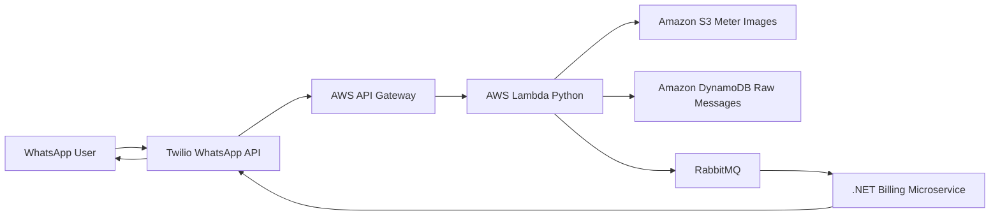
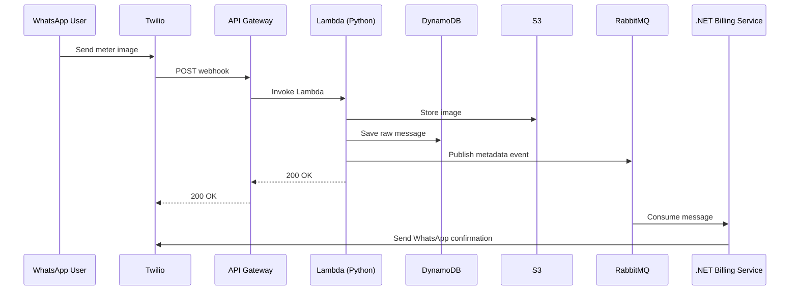
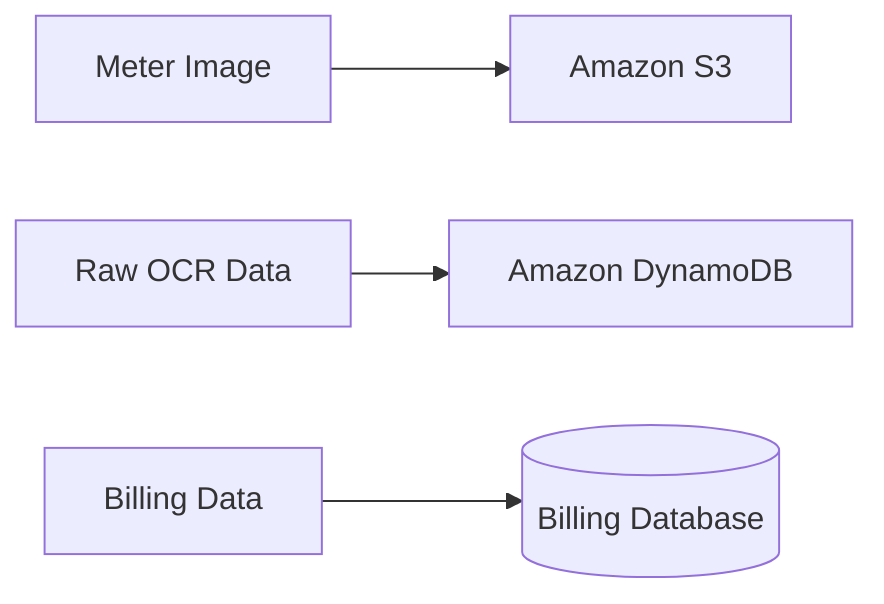

# 📸 WhatsApp Meter Reading Processing System
**A cloud-native, event-driven microservices case study**

---

## 📖 Overview

This project is a real-world, event-driven system that allows users to submit **meter readings via WhatsApp images**.  
Messages are processed asynchronously and stored for **monthly billing generation**.

The system integrates **Twilio WhatsApp webhooks**, **AWS serverless services**, **RabbitMQ**, **Python**, and **.NET microservices** to demonstrate a scalable, production-oriented architecture.

This repository focuses on **system design, messaging, reliability, and cloud-native patterns**.

---

## 🧠 Problem Statement

Utility providers often require customers to submit monthly meter readings.  
Manual or in-person collection is inefficient, error-prone, and difficult to scale.

### Requirements
- Customers submit meter readings using WhatsApp
- Images must be stored and processed asynchronously
- The system must handle traffic spikes
- Failures must not block user responses
- Billing data must be reliable and auditable

---

## ✅ Solution Summary

The solution uses an **event-driven architecture** where:
- WhatsApp messages are ingested through Twilio
- AWS Lambda handles lightweight request processing
- RabbitMQ decouples ingestion from billing logic
- A .NET microservice stores billing-ready data
- Users receive asynchronous WhatsApp confirmations

---

## 🏗️ High-Level Architecture


### 🔄 System Flow


✅ Shows end-to-end flow  
✅ Clear service boundaries  
✅ Easy to explain in interviews  

---

### 2️⃣ Detailed Message Processing Flow




 ✅ Shows async behavior  
 ✅ Makes Lambda’s responsibility clear  
 ✅ Highlights fast webhook response 
 
---

## 🧩 Architecture Decisions

### Why Twilio WhatsApp?
- Reliable webhook delivery
- Built-in retries
- Global reach
- No custom mobile app required

---

### Why AWS Lambda for Ingestion?
- Handles burst traffic
- No infrastructure management
- Fast response to Twilio (≤15 seconds)
- Cost-effective

Lambda is intentionally lightweight:
- Validate request
- Persist raw data
- Publish event
- Return HTTP 200 immediately

---

### Why DynamoDB?
- Fast write performance
- Schema flexibility
- Ideal for raw OCR and message data
- Scales automatically

DynamoDB acts as an **audit and recovery store**.

---

### Why RabbitMQ?
This is a **task-based workflow**, not a streaming use case.

RabbitMQ provides:
- Low-latency delivery
- Retry and dead-letter queues
- Simple consumer model

Kafka was considered but deemed unnecessary for this scenario.

---

### Why Python and .NET?
- **Python** is ideal for OCR and text extraction
- **.NET** is well-suited for domain modeling and billing logic
- Messaging ensures loose coupling between services

---

## 📨 Message Design

Images are **not sent through RabbitMQ**.  
Only metadata and intent are published.

  ```json
{
  "messageId": "msg_123456",
  "userPhone": "+27831234567",
  "meterType": "electricity",
  "meterReading": 34567,
  "imageS3Key": "meters/2026/01/msg_123456.jpg",
  "confidence": 0.92,
  "receivedAt": "2026-01-12T08:15:00Z"
}
```

---

## 🗄️ Data Storage Strategy



 ### Amazon S3
  meters/{year}/{month}/{messageId}.jpg
  - Private bucket
  - Encrypted at rest
  - IAM-controlled access

 ### Amazon DynamoDB
  Stores:
  - Raw WhatsApp payloads
  - OCR output
  - Confidence scores
  - Image references

 Used for auditing and recovery.
 ### Billing Database (.NET Service)
  Stores:
  - Validated meter readings
  - Customer references
  - Billing periods
  - Source message IDs
  Used by month-end billing jobs.

---

### 🔁 Failure Handling & Reliability
```mermaid
flowchart TD
    OCR[OCR Processing]
    Retry[RabbitMQ Retry Queue]
    DLQ[Dead Letter Queue]
    Notify[WhatsApp Error Message]

    OCR -->|Success| Billing[Billing Storage]
    OCR -->|Failure| Retry
    Retry -->|Retry Limit Reached| DLQ
    DLQ --> Notify
 ```

  ### OCR Failure
  - Stored in DynamoDB
  - User notified to retry
  - Message not published to RabbitMQ
  ### Consumer Failure
  - RabbitMQ retries enabled
  - Dead-letter queue configured
  - Manual intervention supported
  ### Duplicate Messages
  - WhatsApp message ID used as idempotency key
  - Duplicate processing safely ignored

  ## 🔐 Security Considerations
  - Twilio webhook signature validation
  - HTTPS-only endpoints
  - Least-privilege IAM roles
  - Encrypted S3 and DynamoDB
  - No sensitive data in messages

---

## 🧪 Local Development
 ### Prerequisites
  - Docker & Docker Compose
  - NET SDK
  - Python 3.10+
  - Twilio WhatsApp Sandbox (optional)
  
### Local Services
  - RabbitMQ
  - Python OCR service
  - .NET Billing service
  - Local AWS emulation (optional)
This enables end-to-end testing without AWS costs.

---

##🚀 Deployment Overview
 - API Gateway & Lambda → AWS
 - DynamoDB & S3 → AWS managed services
 - RabbitMQ → Amazon MQ or self-managed
 - .NET service → ECS, EKS, or VM
The system supports incremental scaling.

---

## 🔮 Future Enhancements
  - AI-assisted OCR validation
  - Human review queue for low-confidence images
  - Automated monthly billing jobs
  - Observability and monitoring
  - Multi-tenant support

---

## 📚 Key Learnings
  - Serverless works best when kept small and fast
  - Event-driven systems improve fault isolation
  - Messaging enables language-agnostic services
  - Object storage is best for binary data
 Idempotency is critical for webhook systems

## 🧑‍💻 Author Notes
 This repository is a practical case study demonstrating:
  - Event-driven microservices architecture
  - Cloud-native AWS patterns
  - Real-world messaging workflows
  - Production-oriented design trade-offs
It reflects how similar systems are built in professional environments.
