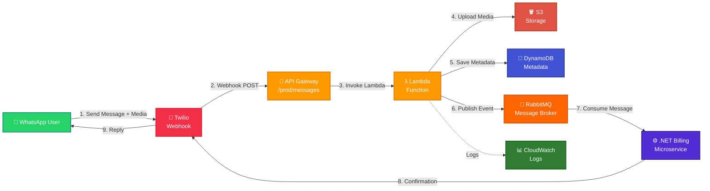
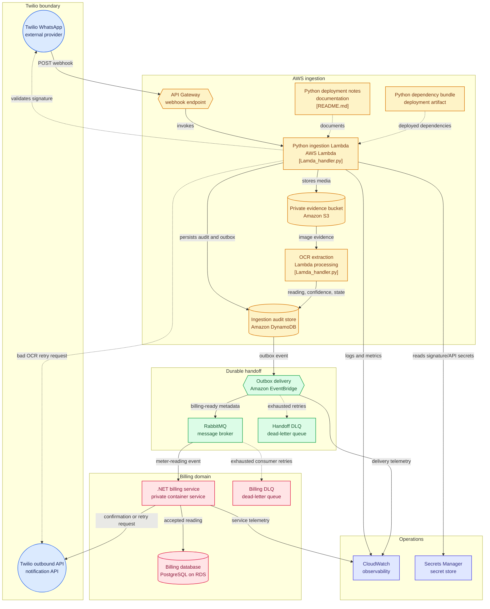
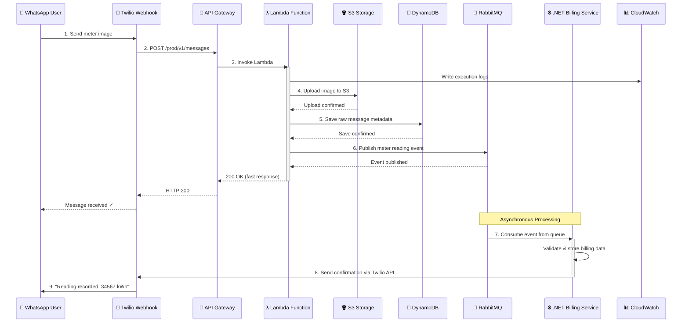
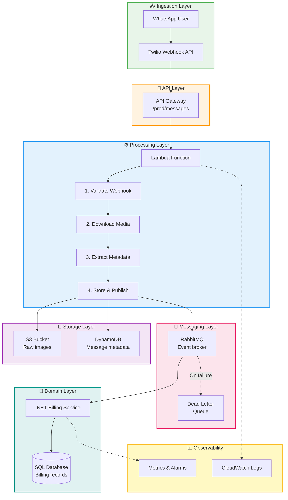
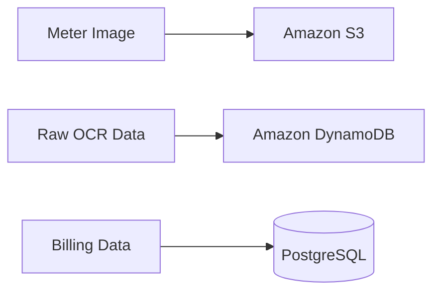

# 📸 WhatsApp Meter Reading Processing System AI 
**A cloud-native, event-driven microservices case study**

---

## 📖 Overview

This project is a real-world, event-driven system that allows users to submit **meter readings via WhatsApp images**.  
Messages are processed asynchronously and stored for **monthly billing generation**.

The system integrates **Twilio WhatsApp webhooks**, **AWS serverless services**, **RabbitMQ**, **Python**, and **.NET microservices** to demonstrate a scalable, production-oriented architecture.

This repository focuses on **system design, messaging, reliability, and cloud-native patterns**.

---

## 🧠 Problem Statement

Utility providers often require customers to submit monthly meter readings.  
Manual or in-person collection is inefficient, error-prone, and difficult to scale.

### Requirements
- Customers submit meter readings using WhatsApp
- Images must be stored and processed asynchronously
- The system must handle traffic spikes
- Failures must not block user responses
- Billing data must be reliable and auditable

---

## ✅ Solution Summary

The solution uses an **event-driven architecture** where:
- WhatsApp messages are ingested through Twilio
- AWS Lambda handles lightweight request processing
- RabbitMQ decouples ingestion from billing logic
- A .NET microservice stores billing-ready data
- Users receive asynchronous WhatsApp confirmations

---

## 🏗️ High-Level Architecture

```mermaid
flowchart LR
    User[📱 WhatsApp User]
    Twilio[🔴 Twilio<br/>Webhook]
    APIGW[🚪 API Gateway<br/>/prod/messages]
    Lambda[λ Lambda<br/>Function]
    S3[🪣 S3<br/>Storage]
    DynamoDB[💾 DynamoDB<br/>Metadata]
    RabbitMQ[🐰 RabbitMQ<br/>Message Broker]
    Billing[⚙️ .NET Billing<br/>Microservice]
    CloudWatch[📊 CloudWatch<br/>Logs]

    User -->|1. Send Message + Media| Twilio
    Twilio -->|2. Webhook POST| APIGW
    APIGW -->|3. Invoke Lambda| Lambda
    Lambda -->|4. Upload Media| S3
    Lambda -->|5. Save Metadata| DynamoDB
    Lambda -->|6. Publish Event| RabbitMQ
    Lambda -.->|Logs| CloudWatch
    RabbitMQ -->|7. Consume Message| Billing
    Billing -->|8. Confirmation| Twilio
    Twilio -->|9. Reply| User

    style User fill:#25D366,stroke:#128C7E,stroke-width:2px,color:#fff
    style Twilio fill:#F22F46,stroke:#D61F3A,stroke-width:2px,color:#fff
    style APIGW fill:#FF9900,stroke:#D97706,stroke-width:2px,color:#fff
    style Lambda fill:#FF9900,stroke:#D97706,stroke-width:2px,color:#fff
    style S3 fill:#E05243,stroke:#B23B2F,stroke-width:2px,color:#fff
    style DynamoDB fill:#4053D6,stroke:#2E3B8F,stroke-width:2px,color:#fff
    style RabbitMQ fill:#FF6600,stroke:#CC5200,stroke-width:2px,color:#fff
    style Billing fill:#512BD4,stroke:#3A1F8F,stroke-width:2px,color:#fff
    style CloudWatch fill:#2E7D32,stroke:#1B5E20,stroke-width:2px,color:#fff

```
📄 Key Architecture Benefits

  ✅ **Decoupled services** - Each component can scale independently  
  ✅ **Asynchronous processing** - Fast webhook responses  
  ✅ **Fault isolation** - Failures don't cascade  
  ✅ **Audit trail** - Complete message history in DynamoDB  
  ✅ **Easy to explain** - Clear service boundaries for interviews

---

### Detailed Architecture Components and Flow

```mermaid
flowchart TD

subgraph group_twilio["Twilio boundary"]
  node_twilio_whatsapp(("Twilio WhatsApp<br/>external provider"))
  node_twilio_api(("Twilio outbound API<br/>notification API"))
end

subgraph group_ingestion["AWS ingestion"]
  node_api_gateway{{"API Gateway<br/>webhook endpoint"}}
  node_lambda["Python ingestion Lambda<br/>AWS Lambda<br/>[Lamda_handler.py]"]
  node_s3[("Private evidence bucket<br/>Amazon S3")]
  node_dynamodb[("Ingestion audit store<br/>Amazon DynamoDB")]
  node_ocr["OCR extraction<br/>Lambda processing<br/>[Lamda_handler.py]"]
  node_python_docs["Python deployment notes<br/>documentation<br/>[README.md]"]
  node_dependency_bundle["Python dependency bundle<br/>deployment artifact"]
end

subgraph group_handoff["Durable handoff"]
  node_eventbridge{{"Outbox delivery<br/>Amazon EventBridge"}}
  node_rabbitmq["RabbitMQ<br/>message broker"]
  node_handoff_dlq["Handoff DLQ<br/>dead-letter queue"]
end

subgraph group_billing["Billing domain"]
  node_billing_service[".NET billing service<br/>private container service"]
  node_rds[("Billing database<br/>PostgreSQL on RDS")]
  node_billing_dlq["Billing DLQ<br/>dead-letter queue"]
end

subgraph group_operations["Operations"]
  node_cloudwatch["CloudWatch<br/>observability"]
  node_secrets["Secrets Manager<br/>secret store"]
end

node_twilio_whatsapp -->|"POST webhook"| node_api_gateway
node_api_gateway -->|"invokes"| node_lambda
node_lambda -->|"reads signature/API secrets"| node_secrets
node_lambda -.->|"validates signature"| node_twilio_whatsapp
node_lambda -->|"stores media"| node_s3
node_lambda -->|"persists audit and outbox"| node_dynamodb
node_s3 -->|"image evidence"| node_ocr
node_ocr -->|"reading, confidence, state"| node_dynamodb
node_dynamodb -->|"outbox event"| node_eventbridge
node_eventbridge -->|"billing-ready metadata"| node_rabbitmq
node_eventbridge -.->|"exhausted retries"| node_handoff_dlq
node_rabbitmq -->|"meter-reading event"| node_billing_service
node_rabbitmq -.->|"exhausted consumer retries"| node_billing_dlq
node_billing_service -->|"accepted reading"| node_rds
node_billing_service -->|"confirmation or retry request"| node_twilio_api
node_lambda -.->|"bad OCR retry request"| node_twilio_api
node_lambda -->|"logs and metrics"| node_cloudwatch
node_eventbridge -->|"delivery telemetry"| node_cloudwatch
node_billing_service -->|"service telemetry"| node_cloudwatch
node_python_docs -.->|"documents"| node_lambda
node_dependency_bundle -.->|"deployed dependencies"| node_lambda

click node_lambda "https://github.com/mphozazo/whatsapp-meter-reading-system/blob/main/src/python/Lamda_handler.py"
click node_ocr "https://github.com/mphozazo/whatsapp-meter-reading-system/blob/main/src/python/Lamda_handler.py"
click node_python_docs "https://github.com/mphozazo/whatsapp-meter-reading-system/blob/main/src/python/README.md"
click node_dependency_bundle "https://github.com/mphozazo/whatsapp-meter-reading-system/blob/main/src/python/python_request_package.zip"

classDef toneNeutral fill:#f8fafc,stroke:#334155,stroke-width:1.5px,color:#0f172a
classDef toneBlue fill:#dbeafe,stroke:#2563eb,stroke-width:1.5px,color:#172554
classDef toneAmber fill:#fef3c7,stroke:#d97706,stroke-width:1.5px,color:#78350f
classDef toneMint fill:#dcfce7,stroke:#16a34a,stroke-width:1.5px,color:#14532d
classDef toneRose fill:#ffe4e6,stroke:#e11d48,stroke-width:1.5px,color:#881337
classDef toneIndigo fill:#e0e7ff,stroke:#4f46e5,stroke-width:1.5px,color:#312e81
classDef toneTeal fill:#ccfbf1,stroke:#0f766e,stroke-width:1.5px,color:#134e4a
class node_twilio_whatsapp,node_twilio_api toneBlue
class node_api_gateway,node_lambda,node_s3,node_dynamodb,node_ocr,node_python_docs,node_dependency_bundle toneAmber
class node_eventbridge,node_rabbitmq,node_handoff_dlq toneMint
class node_billing_service,node_rds,node_billing_dlq toneRose
class node_cloudwatch,node_secrets toneIndigo

```
---

### Detailed Message Processing Flow


```mermaid
sequenceDiagram
    participant U as 📱 WhatsApp User
    participant T as 🔴 Twilio Webhook
    participant G as 🚪 API Gateway
    participant L as λ Lambda Function
    participant S as 🪣 S3 Storage
    participant D as 💾 DynamoDB
    participant R as 🐰 RabbitMQ
    participant B as ⚙️ .NET Billing Service
    participant CW as 📊 CloudWatch

    U->>T: 1. Send meter image
    T->>G: 2. POST /prod/v1/messages
    G->>L: 3. Invoke Lambda
    
    activate L
    L->>CW: Write execution logs
    L->>S: 4. Upload image to S3
    S-->>L: Upload confirmed
    L->>D: 5. Save raw message metadata
    D-->>L: Save confirmed
    L->>R: 6. Publish meter reading event
    R-->>L: Event published
    L-->>G: 200 OK (fast response)
    deactivate L
    
    G-->>T: HTTP 200
    T-->>U: Message received ✓
    
    Note over R,B: Asynchronous Processing
    R->>B: 7. Consume event from queue
    activate B
    B->>B: Validate & store billing data
    B->>T: 8. Send confirmation via Twilio API
    deactivate B
    
    T->>U: 9. "Reading recorded: 34567 kWh"

```
 Processing Highlights
 
  ✅ **Sub-second webhook response** - Lambda returns 200 OK immediately  
  ✅ **Reliable message delivery** - RabbitMQ handles retries and dead-letter queues  
  ✅ **Asynchronous confirmation** - Users receive updates after processing completes  
  ✅ **Full observability** - CloudWatch logs every step

### 🏗️ Component Architecture

```mermaid

flowchart TB
    subgraph Input["📥 Ingestion Layer"]
        direction LR
        WA[WhatsApp User]
        TW[Twilio Webhook API]
    end

    subgraph Gateway["🚪 API Layer"]
        direction LR
        APG[API Gateway<br/>/prod/messages]
    end

    subgraph Processing["⚙️ Processing Layer"]
        direction TB
        LF[Lambda Function]
        LF1[1. Validate Webhook]
        LF2[2. Download Media]
        LF3[3. Extract Metadata]
        LF4[4. Store & Publish]
        LF --> LF1
        LF1 --> LF2
        LF2 --> LF3
        LF3 --> LF4
    end

    subgraph Storage["💾 Storage Layer"]
        direction LR
        S3B[S3 Bucket<br/>Raw images]
        DB[DynamoDB<br/>Message metadata]
    end

    subgraph Messaging["📨 Messaging Layer"]
        direction LR
        MQ[RabbitMQ<br/>Event broker]
        DLQ[Dead Letter<br/>Queue]
    end

    subgraph Domain["🎯 Domain Layer"]
        direction LR
        NET[.NET Billing Service]
        SQL[(SQL Database<br/>Billing records)]
    end

    subgraph Monitoring["📊 Observability"]
        direction LR
        CW[CloudWatch Logs]
        Metrics[Metrics & Alarms]
    end

    WA --> TW
    TW --> APG
    APG --> LF
    LF4 --> S3B
    LF4 --> DB
    LF4 --> MQ
    LF -.-> CW
    MQ --> NET
    MQ -.->|On failure| DLQ
    NET --> SQL
    NET -.-> Metrics

    style Input fill:#E8F5E9,stroke:#4CAF50,stroke-width:2px
    style Gateway fill:#FFF3E0,stroke:#FF9800,stroke-width:2px
    style Processing fill:#E3F2FD,stroke:#2196F3,stroke-width:2px
    style Storage fill:#F3E5F5,stroke:#9C27B0,stroke-width:2px
    style Messaging fill:#FCE4EC,stroke:#E91E63,stroke-width:2px
    style Domain fill:#E0F2F1,stroke:#009688,stroke-width:2px
    style Monitoring fill:#FFF9C4,stroke:#FBC02D,stroke-width:2px
```

---

## 🧩 Architecture Decisions

### Why Twilio WhatsApp?
- Reliable webhook delivery
- Built-in retries
- Global reach
- No custom mobile app required

---

### Why AWS Lambda for Ingestion?
- Handles burst traffic
- No infrastructure management
- Fast response to Twilio (≤15 seconds)
- Cost-effective

Lambda is intentionally lightweight:

 ```python

  def lambda_handler(event, context):
    # 1. Validate Twilio signature
    # 2. Extract message metadata
    # 3. Store raw data (S3 + DynamoDB)
    # 4. Publish event to RabbitMQ
    # 5. Return 200 OK immediately
    return {"statusCode": 200}
 ```
---

### Why DynamoDB?
- Fast write performance
- Schema flexibility
- Ideal for raw OCR and message data
- Scales automatically

DynamoDB acts as an **audit and recovery store**.

---

### Why RabbitMQ?
This is a **task-based workflow**, not a streaming use case.

RabbitMQ provides:
- Low-latency delivery
- Retry and dead-letter queues
- Simple consumer model

---

### Why Python and .NET?
- **Python** is ideal for OCR and text extraction
- **.NET** is well-suited for domain modeling and billing logic
- Messaging ensures loose coupling between services

---

## 📨 Message Design

Images are **not sent through RabbitMQ**.  
Only metadata and intent are published.

  ```json
{
  "messageId": "msg_123456",
  "userPhone": "+27831234567",
  "meterType": "electricity",
  "meterReading": 34567,
  "memterNumber": 1234567890
  "imageS3Key": "meters/2026/01/msg_123456.jpg",
  "confidence": 0.92,
  "receivedAt": "2026-01-12T08:15:00Z"
}
```
### Design Principles:
 - Small message size (< 1KB) for fast delivery
 - S3 reference instead of binary data
 - Idempotent with messageId as key
 - Contains all data needed for billing 

---

## 🗄️ Data Storage Strategy


```mermaid
flowchart LR
    Image[Meter Image]
    Raw[Raw OCR Data]
    Billing[Billing Data]

    Image --> S3[Amazon S3]
    Raw --> DynamoDB[Amazon DynamoDB]
    Billing --> RelationalDB[(PostgreSQL)]
```

 ### Amazon S3
  **Path :*** meters/{year}/{month}/{messageId}.jpg
  - Private bucket
  - Encrypted at rest
  - IAM-controlled access
  - CloudFront CDN for serving images

 ### Amazon DynamoDB
 **Partition Key:** messageId
  Stores:
  - Raw WhatsApp payloads
  - OCR extraction results
  - Confidence scores
  - S3 image references
  - Processing timestamps
 **Purpose:** Audit trail and recovery. Not used for billing queries.

 ### Billing Database (.NET Service)
  **Technology:** PostgreSQL
  Stores:
  - Validated meter readings
  - Customer references
  - Billing periods
  - Source message IDs
  **Used by :** Month-end billing jobs.

---

### 🔁 Failure Handling & Reliability
```mermaid
flowchart TD
    OCR[Lambda OCR Processing]
    Outbox[Outbox Table DynamoDB]
    EventBridge[EventBridge Retry]
    RabbitMQ[RabbitMQ Cluster ECS Fargate]
    Billing[Billing Service Storage]
    DLQ[Dead Letter Queue]
    Notify[WhatsApp Error Message]

    %% Success path
    OCR -->|Success| Outbox
    Outbox --> EventBridge
    EventBridge --> RabbitMQ
    RabbitMQ --> Billing

    %% Failure paths
    OCR -->|Failure| DLQ
    EventBridge -->|Retry Limit Reached| DLQ
    RabbitMQ -->|Consumer Failure + Retry Limit| DLQ
    DLQ --> Notify

 ```
 ### Failure Scenarios
 #### 1. OCR Processing Failure
- ❌ Image quality too poor to read
- ✅ Message stored in **DynamoDB** with `status: FAILED`
- ✅ User notified on **Whatzapp** to retry with clearer image
- ✅ No RabbitMQ event published

#### 2. RabbitMQ Consumer Failure
- ❌ Lambda writes to Outbox, EventBridge or RabbitMQ unavailable.
- ✅ EventBridge automatically retries delivery with exponential backoff.
- ✅ After max retries (e.g., 5) → message moved to DLQ.
- ✅ CloudWatch alarm triggers ops notification.

### 3. RabbitMQ Consumer Failure (Billing Service)
- ❌ Billing ECS Fargate service crashes or RDS unavailable.
- ✅ Message remains in RabbitMQ queue.
- ✅ Automatic retries with backoff.
- ✅ After **max retries → DLQ**, CloudWatch alarm triggers.
  
#### 4. Duplicate Messages
- ❌ User sends same image twice
- ✅ **WhatsApp `MessageSid`** used as idempotency key
- ✅ Duplicate processing safely ignored
- ✅ User receives "Already processed" message
---
   ## 🔐 Security Considerations
- ✅ **Twilio webhook signature validation** - Prevents unauthorized requests
- ✅ **HTTPS-only endpoints** - TLS 1.2+ encryption
- ✅ **Least-privilege IAM roles** - Lambda can only access required resources
- ✅ **Encrypted S3 and DynamoDB** - S3 and DynamoDB encryption at rest
- ✅ **No sensitive data in messages** - Personal info in separate secure database
- ✅ **Secrets management** - API keys stored in AWS Secrets Manager
- ✅ **VPC isolation** - RabbitMQ and .NET service in private subnets

---

## 🌐 API Endpoints
**Current Version: v1**
- **Base URL:** `https://zss2qd0la2.execute-api.af-south-1.amazonaws.com/prod/`

### Submit Meter Reading 
 - Method: `POST`
 - Endpoint: `/messages`
 - Full URL: `https://zss2qd0la2.execute-api.af-south-1.amazonaws.com/prod/messages`
 - Content-Type: `application/x-www-form-urlencoded (Twilio format)`
 - Authentication: `Twilio webhook signature`
 ### Request Headers:
 - X-Twilio-Signature: `<computed_signature>`
 - Content-Type: `application/x-www-form-urlencoded`
### Response:
```xml
 <?xml version="1.0" encoding="UTF-8"?>
 <Response>
    <Message>Thank you! Your meter reading has been received.</Message>
 </Response>
```

## 🧪 Local Development
 ### Prerequisites
  - Docker & Docker Compose
  - NET 8.0 SDK
  - Python 3.10+
  - Twilio WhatsApp Sandbox (optional)
  - AWS CLI (optional, for testing S3/DynamoDB)
  
### Local Services
  - **RabbitMQ :** -- Message broker on port 5672
  - **RabbitMQ Management UI** - http://localhost:15672
  - **Python OCR service** - Simulated locally
  - **.NET Billing service** - - Runs on port 5001
  - **Local AWS emulation (optional)** - AWS services emulation (S3, DynamoDB)
 This enables **end-to-end testing without AWS costs**.

---

## 🚀 Deployment Overview

```mermaid
flowchart TB
    %% External
    Twilio[Twilio WhatsApp API]

    %% AWS Cloud
    subgraph AWS["AWS Cloud"]
        direction TB

        %% Serverless
        subgraph Serverless["Serverless"]
            APIGW[API Gateway]
            Lambda[Lambda OCR User Confirmation]
        end

        %% Storage
        subgraph Storage["Storage"]
            S3[S3 Bucket]
            Outbox[Outbox Table DynamoDB]
        end

        %% Event-driven retry
        EventBridge[EventBridge Retry Outbox]

        %% Compute
        subgraph Compute["Compute"]
            RabbitMQ[RabbitMQ Cluster EC2 Fargate]
            Billing[EC2 Fargate Billing Service]
            RDS[PostgreSQL RDS]
        end

        %% Monitoring
        subgraph Monitoring["Monitoring"]
            CloudWatch[CloudWatch Logs]
            Alarms[CloudWatch Alarms]
        end
    end

    %% Connections
    Twilio --> APIGW
    APIGW --> Lambda
    Lambda --> S3
    Lambda --> CloudWatch
    Billing --> RDS
    Billing --> Alarms

    %% Main message flow
    Lambda --> Outbox
    Outbox --> EventBridge
    EventBridge --> RabbitMQ
    RabbitMQ --> Billing
  ```

### Deployment Strategy

| Component | Platform | Scaling |
|-----------|----------|---------|
| **API Gateway + Lambda** | AWS Serverless | Automatic (up to 1000 concurrent) |
| **S3 + DynamoDB** | AWS Managed | Automatic |
| **RabbitMQ** | Self-Hosting | Vertical (larger instances) |
| **.NET Service(Microservices)** | ECS Fargate / EKS | Horizontal (add containers) |
| **PostgreSQL Database** |Aws Managed RDS | Read replicas for reporting |

The system supports **incremental scaling**- start small and grow as needed..

---

## 🔮 Future Enhancements
 - 🤖 AI-assisted OCR validation - Use AWS Textract or custom ML models
 - 👁️ Human review queue - Flag low-confidence readings for manual verification
 - 📅 Automated monthly billing jobs - Generate invoices from accumulated readings
 - 📊 Observability dashboard - Grafana + Prometheus for real-time monitoring
 - 🏢 Multi-tenant support - Separate data by utility provider
 - 📱 Mobile app integration - Native iOS/Android apps with direct API access
 - 🌍 Multi-region deployment - Reduce latency for international users

---

## 📚 Key Learnings

💡 **Serverless works best when kept small and fast**  
Don't try to do too much in Lambda - persist, publish, and return quickly.

💡 **Event-driven systems improve fault isolation**  
When RabbitMQ or .NET service fails, Lambda still accepts messages.

💡 **Messaging enables language-agnostic services**  
Python for lightweight tasks, .NET for domain logic - best of both worlds.

💡 **Object storage is best for binary data**  
Never send images through message queues - use references instead.

💡 **Idempotency is critical for webhook systems**  
Twilio may retry webhooks - your system must handle duplicates gracefully.

💡 **Observability is not optional**  
Without CloudWatch logs, debugging production issues is impossible.
 Object storage is best for binary data
 Idempotency is critical for webhook systems

## 🧑‍💻 Author Notes
 This repository is a practical case study demonstrating:
  - Event-driven microservices architecture
  - Cloud-native AWS patterns
  - Real-world messaging workflows
  - Production-oriented design trade-offs
It reflects how similar systems are built in professional environments.

### 💼 About This Project

This repository is a **practical case study** demonstrating:
- Event-driven microservices architecture
- Cloud-native AWS patterns
- Real-world messaging workflows
- Production-oriented design trade-offs

It reflects how similar systems are built in **professional enterprise environments**.

---

## 📬 Contributing & Feedback

Interested in this project? Here's how you can engage:

- ⭐ **Star this repository** if you find it useful
- 🐛 **Report issues** or suggest improvements via [GitHub Issues](https://github.com/Mphozazo/Whatsapp-meter-reading-system/issues)
- 🔀 **Fork and experiment** with your own implementations
- 💬 **Connect on LinkedIn** to discuss architecture patterns

---

## 📄 License

This project is not licensed 

“All rights reserved. Forking is allowed; any other use is prohibited.”
---

<div align="center">

**[⭐ Star this repo](https://github.com/Mphozazo/Whatsapp-meter-reading-system)** | **[🔗 View on GitHub](https://github.com/Mphozazo/Whatsapp-meter-reading-system)** | **[👤 More Projects](https://github.com/Mphozazo)**

---

*Building reliable, scalable, and production-ready systems with modern cloud-native architecture*

</div>
