# 📸 WhatsApp Meter Reading Processing System
**A cloud-native, event-driven microservices case study**

---

## 📖 Overview

This project is a real-world, event-driven system that allows users to submit **meter readings via WhatsApp images**.  
Messages are processed asynchronously and stored for **monthly billing generation**.

The system integrates **Twilio WhatsApp webhooks**, **AWS serverless services**, **RabbitMQ**, **Python**, and **.NET microservices** to demonstrate a scalable, production-oriented architecture.

This repository focuses on **system design, messaging, reliability, and cloud-native patterns**.

---

## 🧠 Problem Statement

Utility providers often require customers to submit monthly meter readings.  
Manual or in-person collection is inefficient, error-prone, and difficult to scale.

### Requirements
- Customers submit meter readings using WhatsApp
- Images must be stored and processed asynchronously
- The system must handle traffic spikes
- Failures must not block user responses
- Billing data must be reliable and auditable

---

## ✅ Solution Summary

The solution uses an **event-driven architecture** where:
- WhatsApp messages are ingested through Twilio
- AWS Lambda handles lightweight request processing
- RabbitMQ decouples ingestion from billing logic
- A .NET microservice stores billing-ready data
- Users receive asynchronous WhatsApp confirmations

---

## 🏗️ High-Level Architecture

📄 Key Architecture Benefits

  ✅ **Decoupled services** - Each component can scale independently  
  ✅ **Asynchronous processing** - Fast webhook responses  
  ✅ **Fault isolation** - Failures don't cascade  
  ✅ **Audit trail** - Complete message history in DynamoDB  
  ✅ **Easy to explain** - Clear service boundaries for interviews

 

---

### 2️⃣ Detailed Message Processing Flow

```mermaid
sequenceDiagram
    participant U as 📱 WhatsApp User
    participant T as 🔴 Twilio Webhook
    participant G as 🚪 API Gateway
    participant L as λ Lambda Function
    participant S as 🪣 S3 Storage
    participant D as 💾 DynamoDB
    participant R as 🐰 RabbitMQ
    participant B as ⚙️ .NET Billing Service
    participant CW as 📊 CloudWatch

    U->>T: 1. Send meter image
    T->>G: 2. POST /prod/v1/messages
    G->>L: 3. Invoke Lambda
    
    activate L
    L->>CW: Write execution logs
    L->>S: 4. Upload image to S3
    S-->>L: Upload confirmed
    L->>D: 5. Save raw message metadata
    D-->>L: Save confirmed
    L->>R: 6. Publish meter reading event
    R-->>L: Event published
    L-->>G: 200 OK (fast response)
    deactivate L
    
    G-->>T: HTTP 200
    T-->>U: Message received ✓
    
    Note over R,B: Asynchronous Processing
    R->>B: 7. Consume event from queue
    activate B
    B->>B: Validate & store billing data
    B->>T: 8. Send confirmation via Twilio API
    deactivate B
    
    T->>U: 9. "Reading recorded: 34567 kWh"

```


 Processing Highlights
 
  ✅ **Sub-second webhook response** - Lambda returns 200 OK immediately  
  ✅ **Reliable message delivery** - RabbitMQ handles retries and dead-letter queues  
  ✅ **Asynchronous confirmation** - Users receive updates after processing completes  
  ✅ **Full observability** - CloudWatch logs every step

### 🏗️ Component Architecture


---

## 🧩 Architecture Decisions

### Why Twilio WhatsApp?
- Reliable webhook delivery
- Built-in retries
- Global reach
- No custom mobile app required

---

### Why AWS Lambda for Ingestion?
- Handles burst traffic
- No infrastructure management
- Fast response to Twilio (≤15 seconds)
- Cost-effective

Lambda is intentionally lightweight:

 ```python

  def lambda_handler(event, context):
    # 1. Validate Twilio signature
    # 2. Extract message metadata
    # 3. Store raw data (S3 + DynamoDB)
    # 4. Publish event to RabbitMQ
    # 5. Return 200 OK immediately
    return {"statusCode": 200}
 ```
---

### Why DynamoDB?
- Fast write performance
- Schema flexibility
- Ideal for raw OCR and message data
- Scales automatically

DynamoDB acts as an **audit and recovery store**.

---

### Why RabbitMQ?
This is a **task-based workflow**, not a streaming use case.

RabbitMQ provides:
- Low-latency delivery
- Retry and dead-letter queues
- Simple consumer model

---

### Why Python and .NET?
- **Python** is ideal for OCR and text extraction
- **.NET** is well-suited for domain modeling and billing logic
- Messaging ensures loose coupling between services

---

## 📨 Message Design

Images are **not sent through RabbitMQ**.  
Only metadata and intent are published.

  ```json
{
  "messageId": "msg_123456",
  "userPhone": "+27831234567",
  "meterType": "electricity",
  "meterReading": 34567,
  "imageS3Key": "meters/2026/01/msg_123456.jpg",
  "confidence": 0.92,
  "receivedAt": "2026-01-12T08:15:00Z"
}
```
### Design Principles:
 - Small message size (< 1KB) for fast delivery
 - S3 reference instead of binary data
 - Idempotent with messageId as key
 - Contains all data needed for billing 

---

## 🗄️ Data Storage Strategy


 ### Amazon S3
  **Path :*** meters/{year}/{month}/{messageId}.jpg
  - Private bucket
  - Encrypted at rest
  - IAM-controlled access
  - CloudFront CDN for serving images

 ### Amazon DynamoDB
 **Partition Key:** messageId
  Stores:
  - Raw WhatsApp payloads
  - OCR extraction results
  - Confidence scores
  - S3 image references
  - Processing timestamps
 **Purpose:** Audit trail and recovery. Not used for billing queries.

 ### Billing Database (.NET Service)
  **Technology:** PostgreSQL
  Stores:
  - Validated meter readings
  - Customer references
  - Billing periods
  - Source message IDs
  **Used by :** Month-end billing jobs.

---

### 🔁 Failure Handling & Reliability
```mermaid
flowchart TD
    OCR[OCR Processing]
    Retry[RabbitMQ Retry Queue]
    DLQ[Dead Letter Queue]
    Notify[WhatsApp Error Message]

    OCR -->|Success| Billing[Billing Storage]
    OCR -->|Failure| Retry
    Retry -->|Retry Limit Reached| DLQ
    DLQ --> Notify
 ```
 ### Failure Scenarios
 #### 1. OCR Processing Failure
- ❌ Image quality too poor to read
- ✅ Message stored in DynamoDB with `status: FAILED`
- ✅ User notified to retry with clearer image
- ✅ No RabbitMQ event published

#### 2. RabbitMQ Consumer Failure
- ❌ .NET service crashes or database unavailable
- ✅ Message remains in queue
- ✅ Automatic retry with exponential backoff
- ✅ After 5 retries → Dead Letter Queue
- ✅ CloudWatch alarm triggers ops notification

#### 3. Duplicate Messages
- ❌ User sends same image twice
- ✅ WhatsApp `MessageSid` used as idempotency key
- ✅ Duplicate processing safely ignored
- ✅ User receives "Already processed" message


---
  ## 🔐 Security Considerations
  - ✅ **Twilio webhook signature validation** - Prevents unauthorized requests
  - ✅ **HTTPS-only endpoints** - TLS 1.2+ encryption
  - ✅ **Least-privilege IAM roles** - Lambda can only access required resources
  - ✅ **Encrypted S3 and DynamoDB** - S3 and DynamoDB encryption at rest
  - ✅ **No sensitive data in messages** - Personal info in separate secure database
  - ✅ **Secrets management** - API keys stored in AWS Secrets Manager
  - ✅ **VPC isolation** - RabbitMQ and .NET service in private subnets

---

## 🌐 API Endpoints
**Current Version: v1**
- **Base URL:** `https://zss2qd0la2.execute-api.af-south-1.amazonaws.com/prod/`

### Submit Meter Reading 
 - Method: `POST`
 - Endpoint: `/messages`
 - Full URL: `https://zss2qd0la2.execute-api.af-south-1.amazonaws.com/prod/messages`
 - Content-Type: `application/x-www-form-urlencoded (Twilio format)`
 - Authentication: `Twilio webhook signature`
 ### Request Headers:
 - X-Twilio-Signature: `<computed_signature>`
 - Content-Type: `application/x-www-form-urlencoded`
### Response:
```xml
 <?xml version="1.0" encoding="UTF-8"?>
 <Response>
    <Message>Thank you! Your meter reading has been received.</Message>
 </Response>
```

## 🧪 Local Development
 ### Prerequisites
  - Docker & Docker Compose
  - NET 8.0 SDK
  - Python 3.10+
  - Twilio WhatsApp Sandbox (optional)
  - AWS CLI (optional, for testing S3/DynamoDB)
  
### Local Services
  - **RabbitMQ :** -- Message broker on port 5672
  - **RabbitMQ Management UI** - http://localhost:15672
  - **Python OCR service** - Simulated locally
  - **.NET Billing service** - - Runs on port 5001
  - **Local AWS emulation (optional)** - AWS services emulation (S3, DynamoDB)
 This enables **end-to-end testing without AWS costs**.

---

##🚀 Deployment Overview
```mermaid
 flowchart TB
    subgraph AWS["☁️ AWS Cloud"]
        direction TB
        subgraph Serverless["Serverless"]
            APIGW[API Gateway]
            Lambda[Lambda Function]
        end
        
        subgraph Storage["Storage"]
            S3[S3 Bucket]
            DynamoDB[DynamoDB Table]
        end
        
        subgraph Monitoring["Monitoring"]
            CloudWatch[CloudWatch Logs]
            Alarms[CloudWatch Alarms]
        end
    end
    
    subgraph External["🌐 External Services"]
        Twilio[Twilio WhatsApp API]
    end
    
    subgraph OnPrem["🏢 Self-Hosted "]
        RabbitMQ[RabbitMQ Cluster<br/>Amazon MQ]
        BillingService[.NET Billing Service<br/>ECS / EKS / EC2]
        Database[(PostgreSQL<br/>RDS)]
    end

    Twilio <--> APIGW
    APIGW --> Lambda
    Lambda --> S3
    Lambda --> DynamoDB
    Lambda --> CloudWatch
    Lambda --> RabbitMQ
    RabbitMQ --> BillingService
    BillingService --> Database
    BillingService --> Alarms

    style AWS fill:#FF9900,stroke:#D97706,stroke-width:2px,color:#fff
    style External fill:#F22F46,stroke:#D61F3A,stroke-width:2px,color:#fff
    style OnPrem fill:#512BD4,stroke:#3A1F8F,stroke-width:2px,color:#fff
  ```

### Deployment Strategy

| Component | Platform | Scaling |
|-----------|----------|---------|
| **API Gateway + Lambda** | AWS Serverless | Automatic (up to 1000 concurrent) |
| **S3 + DynamoDB** | AWS Managed | Automatic |
| **RabbitMQ** | Self-Hosting | Vertical (larger instances) |
| **.NET Service** | ECS Fargate / EKS | Horizontal (add containers) |
| **PostgreSQL Database** |Self-Hosting | Read replicas for reporting |

The system supports **incremental scaling**- start small and grow as needed..

---

## 🔮 Future Enhancements
 - 🤖 AI-assisted OCR validation - Use AWS Textract or custom ML models
 - 👁️ Human review queue - Flag low-confidence readings for manual verification
 - 📅 Automated monthly billing jobs - Generate invoices from accumulated readings
 - 📊 Observability dashboard - Grafana + Prometheus for real-time monitoring
 - 🏢 Multi-tenant support - Separate data by utility provider
 - 📱 Mobile app integration - Native iOS/Android apps with direct API access
 - 🌍 Multi-region deployment - Reduce latency for international users

---

## 📚 Key Learnings

💡 **Serverless works best when kept small and fast**  
Don't try to do too much in Lambda - persist, publish, and return quickly.

💡 **Event-driven systems improve fault isolation**  
When RabbitMQ or .NET service fails, Lambda still accepts messages.

💡 **Messaging enables language-agnostic services**  
Python for lightweight tasks, .NET for domain logic - best of both worlds.

💡 **Object storage is best for binary data**  
Never send images through message queues - use references instead.

💡 **Idempotency is critical for webhook systems**  
Twilio may retry webhooks - your system must handle duplicates gracefully.

💡 **Observability is not optional**  
Without CloudWatch logs, debugging production issues is impossible.
 Object storage is best for binary data
 Idempotency is critical for webhook systems

## 🧑‍💻 Author Notes
 This repository is a practical case study demonstrating:
  - Event-driven microservices architecture
  - Cloud-native AWS patterns
  - Real-world messaging workflows
  - Production-oriented design trade-offs
It reflects how similar systems are built in professional environments.
