## Whatzapp Process flow (Lambda Function) –  Architecture

```mermaid

flowchart LR
    %% ================= WhatsApp Flow =================
    subgraph WhatsApp["📱 WhatsApp Flow"]
        style WhatsApp fill:#d0f0c0,stroke:#2f7f4f,stroke-width:2px
        User["1️⃣ WhatsApp User"]
        Twilio["2️⃣ Twilio WhatsApp API"]
        APIGW["3️⃣ API Gateway"]
        User -->|Image YES/NO| Twilio
        Twilio -->|Webhook| APIGW
        APIGW --> Lambda
        Lambda["4️⃣ Lambda Meter Processor"]
        Lambda -->|TwiML response| Twilio
        Twilio -->|WhatsApp reply| User
    end

    %% ================= OCR & Storage =================
    subgraph OCR_Storage["🗂 OCR & Storage"]
        style OCR_Storage fill:#fef3c7,stroke:#f4c542,stroke-width:2px
        S3EU["5️⃣ Upload image → S3 Bucket eu-west-1 OCR Media"]
        CF["8️⃣ Create URL → CloudFront CDN"]
        Textract["6️⃣ Amazon Textract (OCR)"]
        DDB["7️⃣ Save reading → DynamoDB MeterReadings"]
        
        Lambda -->|Upload image| S3EU
        S3EU --> Textract
        Textract -->|OCR text| Lambda
        Lambda -->|Save reading| DDB
        Lambda -->|Create URL| CF
        CF --> User
    end

    %% ================= Messaging / RabbitMQ =================
    subgraph Messaging["🐇 RabbitMQ Messaging"]
        style Messaging fill:#d0e7ff,stroke:#1f65a8,stroke-width:2px
        Outbox["9️⃣ Save to OutboxTable if publish fails"]
        RabbitMQ["🔹 10️⃣ RabbitMQ Broker"]
        Billing["💻 11️⃣ C# Billing Consumer"]

        %% Immediate publish
        Lambda -->|Publish to RabbitMQ| RabbitMQ
        RabbitMQ --> Billing

        %% Save failed publish
        Lambda -->|Save to Outbox if fail| Outbox
    end

    %% ================= Scheduled Retry =================
    subgraph EventBridge["⏱ EventBridge Scheduled Rule (Every 2 minutes)"]
        style EventBridge fill:#f3d0ff,stroke:#a042f4,stroke-width:2px
        EventLambda["12️⃣ Lambda: Retry Pending Messages"]
        Outbox -.-> EventLambda
        EventLambda -.->|Retry publish| RabbitMQ
    end


```

---
### 1. Description
- A **serverless message processing architecture** for WhatsApp meter readings.
- Uses **AWS Lambda** to handle incoming WhatsApp messages, OCR processing via **Amazon Textract**, and storage in **DynamoDB**.
- Publishes messages to **RabbitMQ**, ensuring reliable delivery with a **retry mechanism** using **OutboxTable** + **EventBridge**.
- **C# Billing Consumer** processes messages asynchronously from RabbitMQ.
### 2. Benefits
- **Serverless & scalable** – Lambda handles spikes in messages without provisioning servers.
- **Reliable message delivery** – RabbitMQ + Outbox retry ensures messages are not lost.
- **Decoupled architecture** – WhatsApp processing, OCR, storage, and billing are independent.
- **Real-time feedback** – Users receive a WhatsApp response quickly.
- **Audit & persistence** – All messages are saved in DynamoDB, retryable if failures occur.
- **Extensible** – Easy to add new consumers or integrations.
### 3. Process (Step-by-Step)
1. **User sends WhatsApp message/image** → Twilio WhatsApp API receives it.
2. **API Gateway** triggers **Lambda Meter Processor**.
3. **Lambda** processes the message and:
    - Uploads image to **S3**
    - Runs **OCR via Amazon Textract**
    - Saves reading to **DynamoDB MeterReadings**
    - Creates URL via **CloudFront** for user access
    - Sends **TwiML response** back via Twilio.

4. Lambda attempts to publish message to RabbitMQ.
    - ✅ Success → Message delivered to **C# Billing Consumer**.
    - ❌ Failure → Message saved in **OutboxTable**.
5. **EventBridge triggers a retry Lambda every 2 minutes**.
    - Scans **OutboxTable** for pending messages
    - Retries publishing to RabbitMQ with **exponential backoff**
    - Stops after **maximum 5 retries**.
6. **C# Billing Consumer** reads messages from RabbitMQ and processes billing.

### 4. Strengths of This Architecture
* Fully serverless
* Scales automatically
* Region-aware service usage
* Fault-tolerant (retries + confirmations)

### 5. Possible Upgrade (Optional)
* Add Rekognition for blur detection
* Add Step Functions for async OCR
* Support water meters & gas meters
* Admin dashboard (Athena + QuickSight)
