## Whatxapp Process flow (Lambda Function) –  Architecture

```mermaid

flowchart LR
    %% ================= WhatsApp Flow =================
    subgraph WhatsApp["📱 WhatsApp Flow"]
        style WhatsApp fill:#d0f0c0,stroke:#2f7f4f,stroke-width:2px
        User["1️⃣ WhatsApp User"]
        Twilio["2️⃣ Twilio WhatsApp API"]
        APIGW["3️⃣ API Gateway"]
        User -->|Image YES/NO| Twilio
        Twilio -->|Webhook| APIGW
        APIGW --> Lambda
        Lambda["4️⃣ Lambda Meter Processor"]
        Lambda -->|TwiML response| Twilio
        Twilio -->|WhatsApp reply| User
    end

    %% ================= OCR & Storage =================
    subgraph OCR_Storage["🗂 OCR & Storage"]
        style OCR_Storage fill:#fef3c7,stroke:#f4c542,stroke-width:2px
        S3EU["5️⃣ Upload image → S3 Bucket eu-west-1 OCR Media"]
        CF["8️⃣ Create URL → CloudFront CDN"]
        Textract["6️⃣ Amazon Textract (OCR)"]
        DDB["7️⃣ Save reading → DynamoDB MeterReadings"]
        
        Lambda -->|Upload image| S3EU
        S3EU --> Textract
        Textract -->|OCR text| Lambda
        Lambda -->|Save reading| DDB
        Lambda -->|Create URL| CF
        CF --> User
    end

    %% ================= Messaging / RabbitMQ =================
    subgraph Messaging["🐇 RabbitMQ Messaging"]
        style Messaging fill:#d0e7ff,stroke:#1f65a8,stroke-width:2px
        Outbox["9️⃣ Save to OutboxTable if publish fails"]
        RabbitMQ["🔹 10️⃣ RabbitMQ Broker"]
        Billing["💻 11️⃣ C# Billing Consumer"]

        %% Immediate publish
        Lambda -->|Publish to RabbitMQ| RabbitMQ
        RabbitMQ --> Billing

        %% Save failed publish
        Lambda -->|Save to Outbox if fail| Outbox
    end

    %% ================= Scheduled Retry =================
    subgraph EventBridge["⏱ EventBridge Scheduled Rule (Every 2 minutes)"]
        style EventBridge fill:#f3d0ff,stroke:#a042f4,stroke-width:2px
        EventLambda["12️⃣ Lambda: Retry Pending Messages"]
        Outbox -.-> EventLambda
        EventLambda -.->|Retry publish| RabbitMQ
    end


```

### Key Design Decisions

* **eu-west-1** required for Amazon Textract
* DynamoDB stores both *raw* and *confirmed* readings
* WhatsApp YES/NO confirmation ensures data quality

### Data Stored in DynamoDB

* sender (WhatsApp number)
* meterReading (Decimal)
* ocrConfidence
* confirmed (true/false)
* image S3 key
* timestamp

### Strengths of This Architecture

* Fully serverless
* Scales automatically
* Region-aware service usage
* Fault-tolerant (retries + confirmations)
* Optimized for real SA electricity meters

### Possible Upgrade (Optional)

* Add Rekognition for blur detection
* Add Step Functions for async OCR
* Support water meters & gas meters
* Admin dashboard (Athena + QuickSight)
